# Virtual Tennis+

Virtual Tennis+ is a single-player VR tennis game developed in Unity, designed to deliver an immersive and interactive sports experience.  
Its standout feature is seamless integration with a **Companion App**, allowing players to control shots and gameplay dynamics through their smartphone sensors.

---

## 🎮 Gameplay
The game offers two main modes:
- **Arcade Mode** – Choose the opponent's difficulty (Easy, Medium, Hard) and play quick matches.
- **Tournament Mode** – Face opponents of increasing difficulty, earning trophies with each win. A single defeat returns you to the main menu.

The player can:
- Control the racket via **keyboard** or **Companion App**.
- Perform strong or weak shots depending on gesture speed.
- Switch between first-person and third-person views.
- Pause and navigate menus directly from the app or keyboard.

---

## 🛠 Technical Overview
- **Architecture**: Client–server model, with the game acting as the server and the Companion App as the client.
- **Networking**:  
  - UDP broadcast (port 5001) for discovery.  
  - TCP/IP connection for continuous communication and automatic reconnection.

---

## 📂 Core Components
- `CaricaPersonaggio` – Dynamically loads chosen player/AI prefabs.
- `CaricaScena` – Handles asynchronous scene loading with camera animations.
- `Musica` (singleton) – Manages background music across scenes.
- `RacchettaManager` (singleton) – Manages app connection and command processing.
- `GestionePunteggio` – Controls scoring logic, game states, and camera events.
- `Giocatore` / `Bot` – Player and AI logic, each inheriting from `GiocatoreBase`.
- `Palla` – Governs ball movement, collisions, and point assignment.

---

## 🎯 AI Difficulty Levels
Implemented via the `IDifficolta` interface:
- **Easy**: Slow speed, high error rates.
- **Medium**: Balanced stats.
- **Hard**: High speed, low error probability.

---

## 📷 Camera System
The `CameraController` supports smooth transitions between perspectives using linear (`lerp`) and spherical (`slerp`) interpolation.

---

## 🖼 UML Diagram
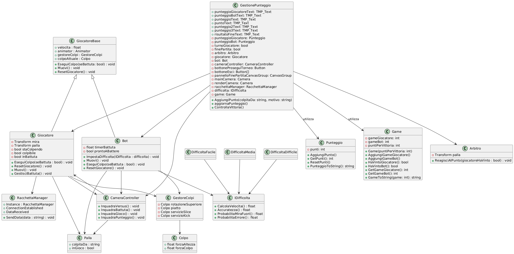

---

## 📸 Screenshots

### Main Menu
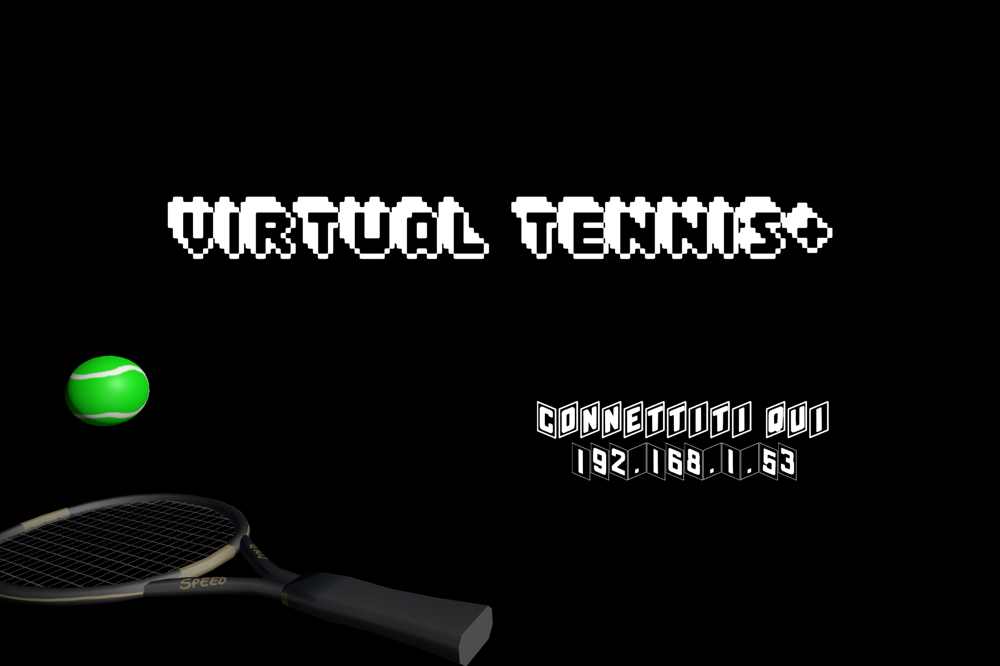
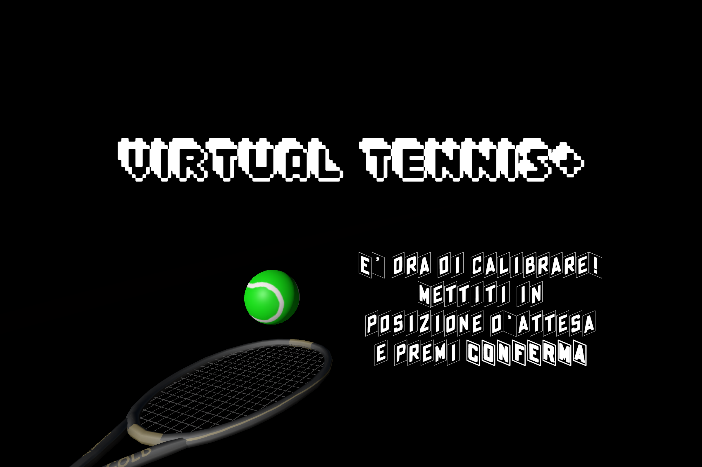

### Player & Scenario Selection
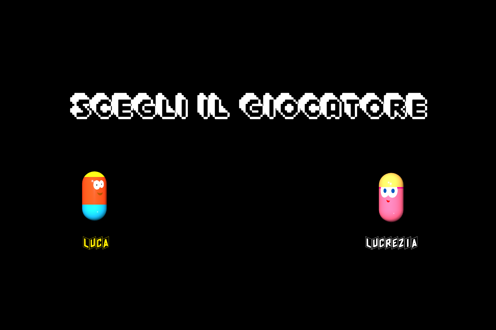
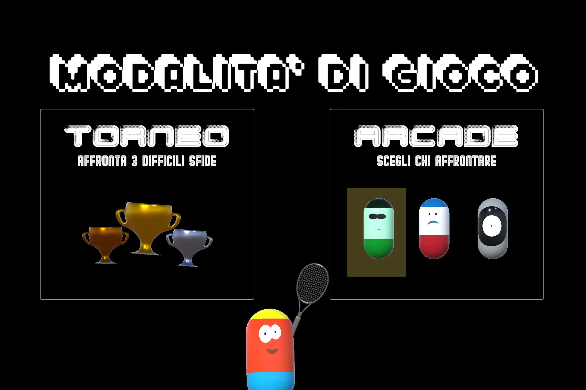

### In-Game – Third Person Mode
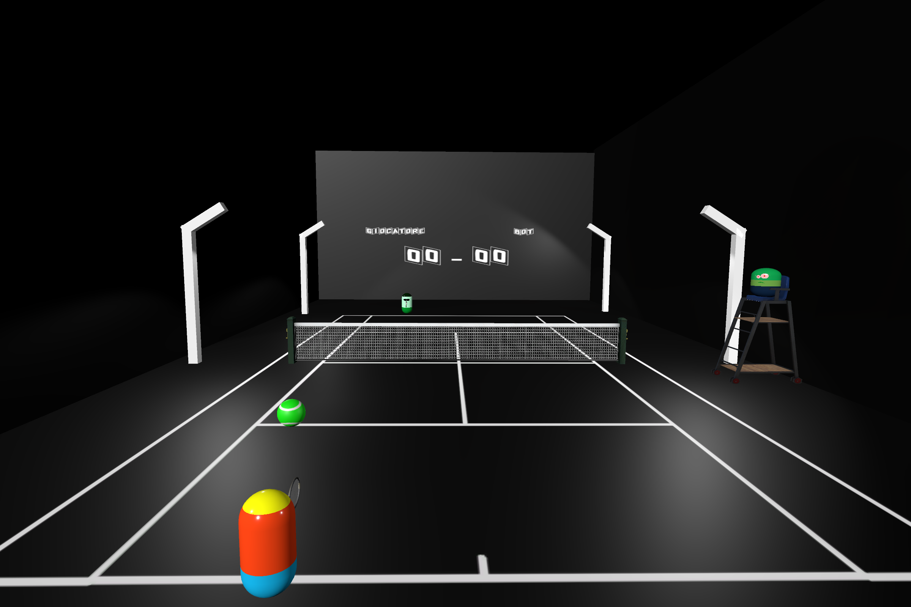
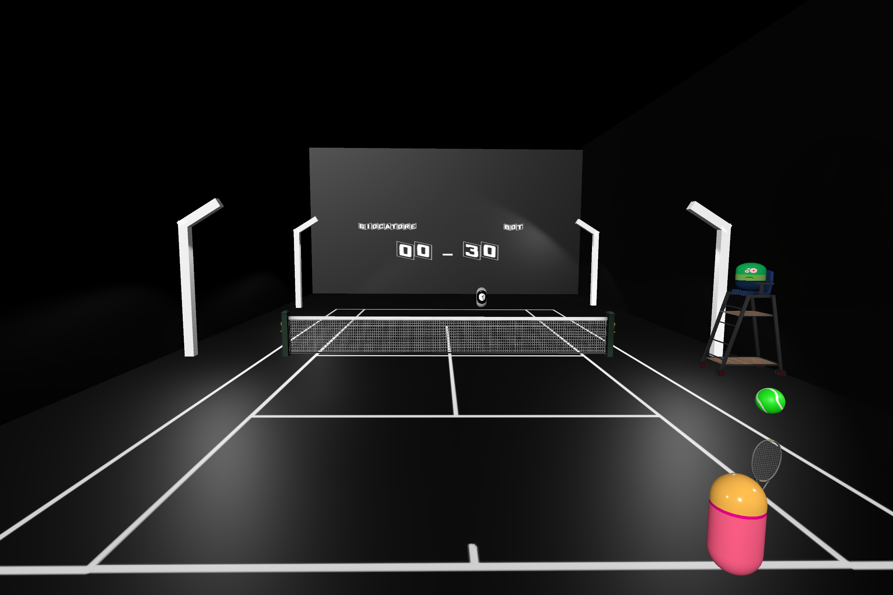

### In-Game – First Person Mode
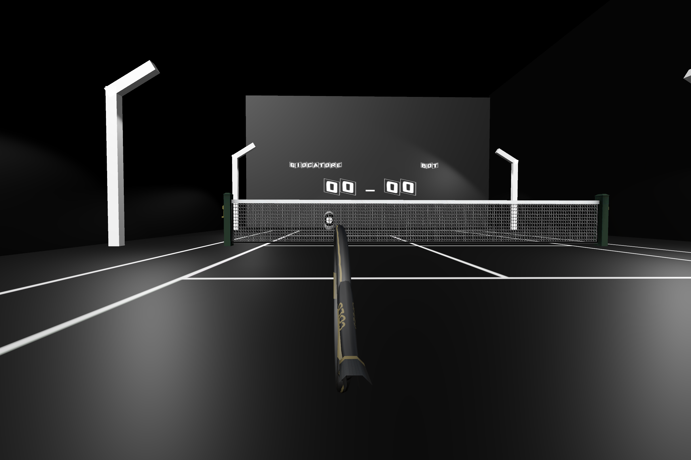

### Pause Menu
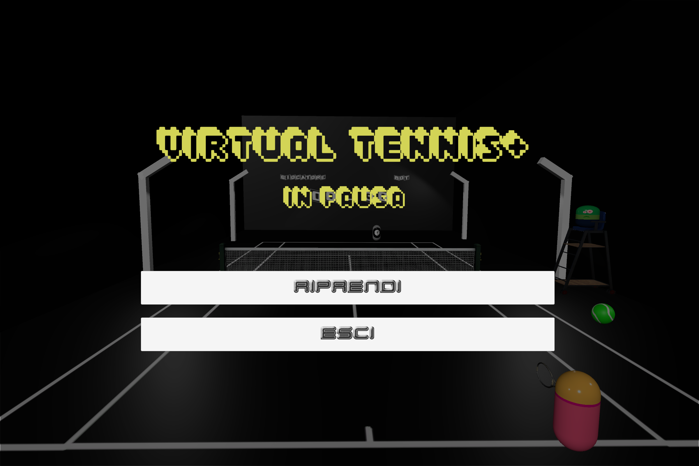

### Scoring & UI Elements
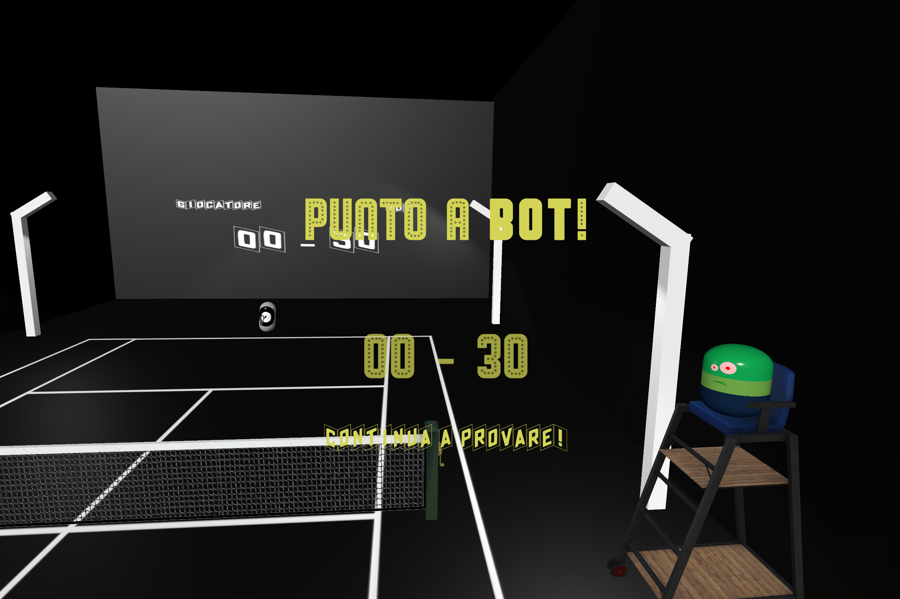

### Victory & Trophy Screens
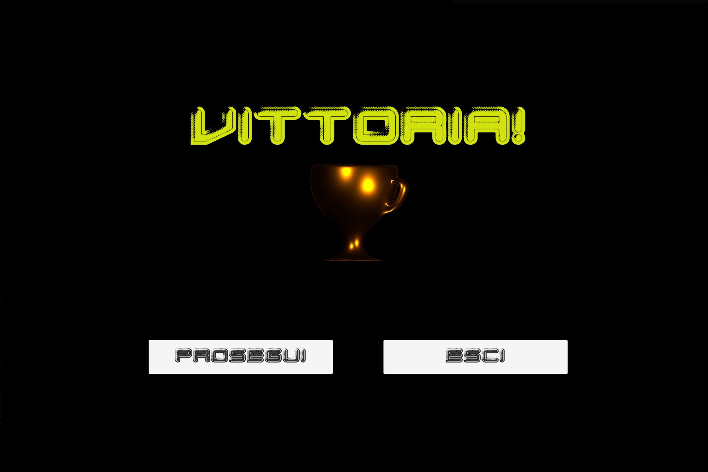

### Other
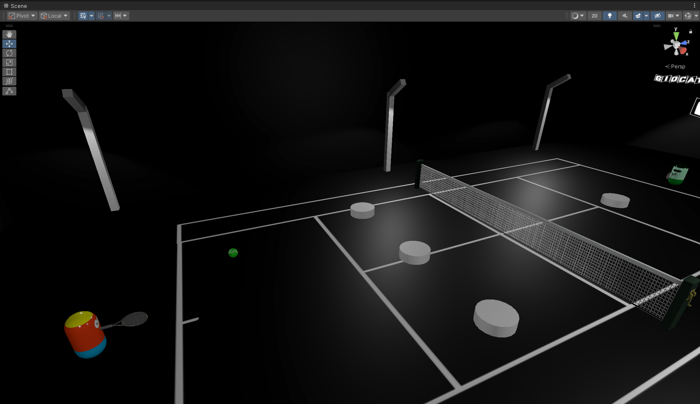
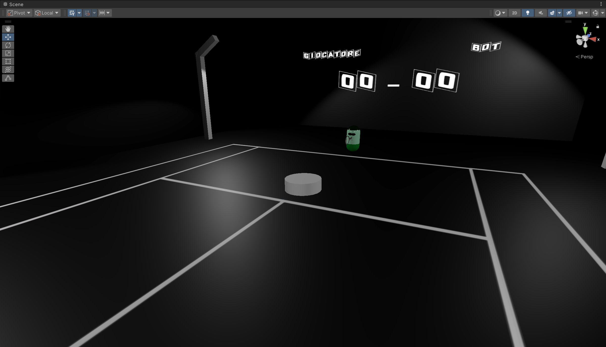
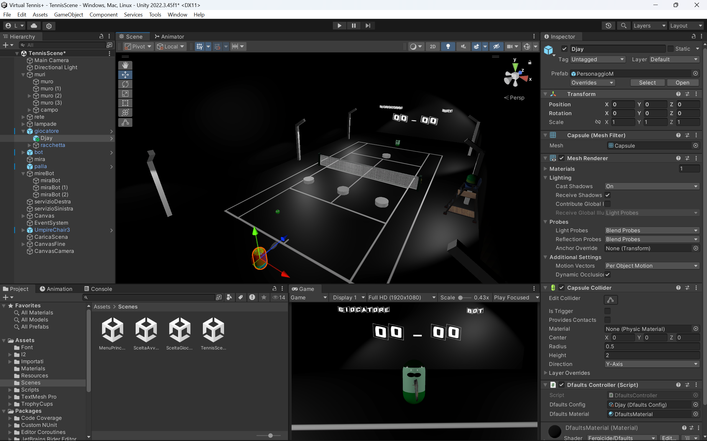

---

## 📜 Credits
Assets and sound effects from:
- THE DFAULTS by fergicide (itch.io)  
- I2TextAnimation  
- Fontget  
- Trophy Cups/Chalices FREE (Unity Asset Store)  
- Soundsnap - Tennis Sound Effects  
- Bensound Music  
